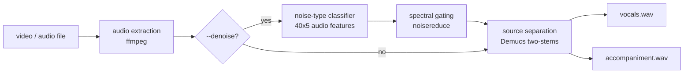

# voice-extractor

voice-extractor pulls clean speech out of noisy audio and video. Give it a
video or audio file and it separates the human voice from everything else:
background music, street noise, engines, sirens. It writes two files,
`vocals.wav` with the speech and `accompaniment.wav` with the rest.

Course project for **CSIT431 Advanced Machine Learning (2023)** at **FLAME University, Pune**, taught by **Professor Santosh Kudtarkar**.

## How it works

A noisy recording usually contains two different problems: environmental
noise and background music. voice-extractor deals with them in two stages:



1. **Environmental denoising (optional).** A small convolutional classifier
   picks the two most likely noise types in the recording, out of the ten
   UrbanSound8K classes (car horns, drilling, sirens, street music, ...).
   Then [noisereduce](https://pypi.org/project/noisereduce/) gates the audio
   against reference recordings of those noise types.
2. **Vocal separation.** [Demucs](https://github.com/adefossez/demucs) splits the
   (optionally denoised) audio into vocals and accompaniment.

## Setup

Requires Python 3.12+. ffmpeg is bundled through `imageio-ffmpeg` (a system
ffmpeg is used if present, but none is required).

```
git clone https://github.com/madhav-gupta-ai/voice-extractor
cd voice-extractor
pip install .
```

## Usage

```
voice-extractor movie_clip.mp4                 # vocals.wav + accompaniment.wav
voice-extractor clip.mp4 --denoise -o results/ # remove environmental noise first
```

`python -m voice_extractor ...` works identically.

| Option | Meaning |
| --- | --- |
| `--denoise` | classify and gate out environmental noise before separation |
| `-o, --output-dir` | where to write the two output files (default: current directory) |
| `--model` | classifier checkpoint for `--denoise` (default: bundled CNN) |

`--denoise` is meant for badly recorded audio, like phone footage or home
video. Skip it on clean, well-produced recordings: gating tends to dull a mix
that was already clean, so the separation stage alone usually sounds better.

## Results

The classifier sees each clip as a 40x5 feature matrix: 40-coefficient
vectors of MFCC, mel spectrogram, chroma-STFT, chroma-CQT and chroma-CENS,
extracted with librosa and averaged over time. The package includes two
architectures, trained on all 8,732 labelled clips of
[UrbanSound8K](https://urbansounddataset.weebly.com/urbansound8k.html)
(7,895 train / 837 test):

| Architecture | Description | Train accuracy | Test accuracy |
| --- | --- | --- | --- |
| `cnn` | two conv blocks + dense layers | 98.15% | 72.40% |
| `unet` | single-level encoder-decoder + linear head | 95.76% | 67.50% |

These are single training runs with the default seed; rerunning the commands
below reproduces them exactly. Across other seeds the CNN stayed in the
72–74% range and the U-Net in the 61–68% range.

The U-Net-style variant swaps the CNN's deep dense stack for a small
convolutional encoder-decoder. It gets by with a fifth of the parameters
(191k vs 999k), but the CNN generalizes better here. Both trained checkpoints
come with the package, and `--denoise` uses the CNN by default, so it works
out of the box.

Retrain either variant from a clone of this repository (a few minutes on CPU;
the feature CSVs are in `data/features/`):

```
python -m voice_extractor.train --arch unet
python -m voice_extractor.train --arch cnn
```

## Repository layout

```
voice_extractor/         the library: extract (CLI), denoise, separate, train, models
voice_extractor/assets/  trained classifier checkpoints + reference noise recordings
data/                    pre-extracted UrbanSound8K features for retraining
```

## Acknowledgments

- [Demucs](https://github.com/adefossez/demucs) — music source separation
- [noisereduce](https://pypi.org/project/noisereduce/) — spectral gating
- [Denoiser](https://github.com/immohann/Denoiser) by Manmohan Dogra — the
  classify-then-gate denoising approach and the reference noise recordings
- [UrbanSound8K](https://urbansounddataset.weebly.com/urbansound8k.html) —
  noise dataset (CC BY-NC 3.0; see [data/README.md](data/README.md))

## License

The code is released under the [MIT License](LICENSE), © 2024 Madhav Gupta. The UrbanSound8K-derived data files
are for non-commercial use only; see [data/README.md](data/README.md).
